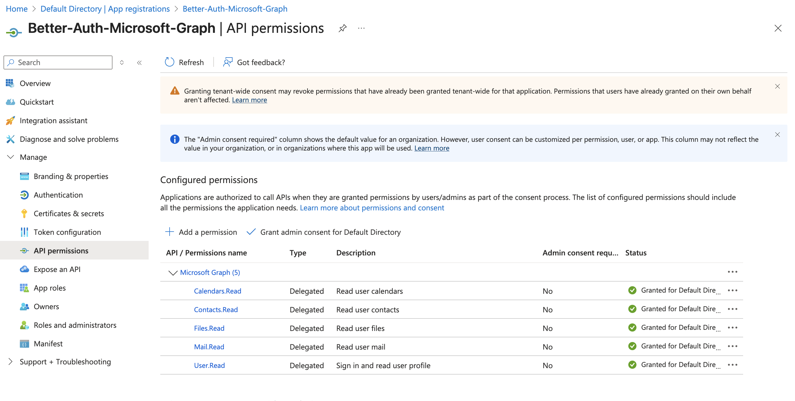

# better-auth-microsoft-graph

Seamlessly integrate [Better Auth](https://github.com/better-auth/better-auth) with Microsoft Graph API to access user profile, calendar, contacts, mail, and OneDrive data.

[](https://www.npmjs.com/package/better-auth-microsoft-graph)
[](https://www.npmjs.com/package/better-auth-microsoft-graph)
[](https://opensource.org/licenses/MIT)

**LIVE DEMO**: [https://better-auth-mg.zpg6.workers.dev/](https://better-auth-mg.zpg6.workers.dev/)

## Features

- 🔑 **Zero OAuth Complexity**: Better Auth handles all authentication flows.
- 👤 **User Profile Access**: Get user information with `authClient.microsoft.me()`
- 📅 **Calendar Integration**: Access calendar and events with `authClient.microsoft.me.events()`
- 📧 **Mail Access**: Read email messages with `authClient.microsoft.me.messages()`
- 👥 **Contacts Management**: Get contacts with `authClient.microsoft.me.contacts()`
- 💾 **OneDrive Integration**: Access drive info with `authClient.microsoft.me.drive()`
- 🔧 **Full TypeScript Support**: Fully typed with Microsoft Graph types.
- ⚡ **Better Auth Plugin**: Seamlessly integrates with Better Auth ecosystem.

## Quick Start

With `better-auth-microsoft-graph`, accessing Microsoft's rich user data is incredibly simple:

### 1. Configure Microsoft as Social Provider

```typescript
import { betterAuth } from "better-auth";
import { microsoft } from "better-auth-microsoft-graph";

export const auth = betterAuth({
    socialProviders: {
        microsoft: {
            clientId: process.env.MICROSOFT_CLIENT_ID!,
            clientSecret: process.env.MICROSOFT_CLIENT_SECRET!,
            scopes: ["User.Read", "Calendars.Read", "Contacts.Read", "Mail.Read", "Files.Read"],
        },
    },
    plugins: [microsoft()],
});
```

### 2. Add Client Plugin

```typescript
import { createAuthClient } from "better-auth/react";
import { microsoftClient } from "better-auth-microsoft-graph/client";

const authClient = createAuthClient({
    plugins: [microsoftClient()],
});
```

### 3. BOOM! 💥 Access Microsoft Graph APIs

```typescript
useEffect(() => {
    const fetchMicrosoftData = async () => {
        // Get user profile
        const profile = await authClient.microsoft.me();
        console.log("User:", profile.data?.data?.displayName);

        // Get calendar events
        const events = await authClient.microsoft.me.events();
        console.log("Upcoming events:", events.data?.data?.length);

        // Get email messages
        const messages = await authClient.microsoft.me.messages();
        console.log("Recent emails:", messages.data?.data?.length);

        // Get contacts
        const contacts = await authClient.microsoft.me.contacts();
        console.log("Contacts:", contacts.data?.data?.length);

        // Get OneDrive info
        const drive = await authClient.microsoft.me.drive();
        console.log("Storage used:", drive.data?.data?.quota?.used);
    };

    fetchMicrosoftData();
}, []);
```

That's it! No complex OAuth flows, no token management, no Graph API setup. Just simple, typesafe access to Microsoft Graph data.

## Roadmap

- [x] Basic `/me` endpoints (👤 Profile, 📅 Calendar, 📧 Mail, 👥 Contacts, 💾 OneDrive)
- [ ] **Graph Query Customizability**
    - [ ] OData query parameters (`$filter`, `$select`, `$expand`, `$orderby`)
    - [ ] Pagination support (`$top`, `$skip`, `@odata.nextLink`)
- [ ] **Real-time Updates with Change Notifications API**
- [ ] **Joined Teams**
- [ ] **SharePoint & Files**
- [ ] **Organization & Directory**
- [ ] **Planner & Tasks**
- [ ] **Batch Requests**
- [ ] **Advanced Outlook**

## Installation

```bash
npm install better-auth-microsoft-graph
# or
yarn add better-auth-microsoft-graph
# or
pnpm add better-auth-microsoft-graph
# or
bun add better-auth-microsoft-graph
```

## Microsoft Graph Endpoints

| Endpoint                              | Client Method                        | Description                 |
| ------------------------------------- | ------------------------------------ | --------------------------- |
| `GET /api/auth/microsoft/me`          | `authClient.microsoft.me()`          | User profile information    |
| `GET /api/auth/microsoft/me/calendar` | `authClient.microsoft.me.calendar()` | User's primary calendar     |
| `GET /api/auth/microsoft/me/events`   | `authClient.microsoft.me.events()`   | User's calendar events      |
| `GET /api/auth/microsoft/me/contacts` | `authClient.microsoft.me.contacts()` | User's contacts             |
| `GET /api/auth/microsoft/me/messages` | `authClient.microsoft.me.messages()` | User's email messages       |
| `GET /api/auth/microsoft/me/drive`    | `authClient.microsoft.me.drive()`    | User's OneDrive information |

## Azure App Registration Setup

To enable Microsoft Graph access, you need to configure API permissions in your Azure App Registration:

| Permission       | Type      | Description         | Admin Consent Required |
| ---------------- | --------- | ------------------- | ---------------------- |
| `User.Read`      | Delegated | Read user profile   | No                     |
| `Calendars.Read` | Delegated | Read user calendars | No                     |
| `Contacts.Read`  | Delegated | Read user contacts  | No                     |
| `Mail.Read`      | Delegated | Read user mail      | No                     |
| `Files.Read`     | Delegated | Read user files     | No                     |

**NOTE**: Only add the permissions you need.

### Setup Steps:

1. Go to [Azure Portal](https://portal.azure.com/) → Azure Active Directory → App registrations
2. Click "New registration" and configure your app
3. Set redirect URI to: `https://your-domain.com/api/auth/callback/microsoft`
4. Go to "API permissions" → "Add a permission" → "Microsoft Graph" → "Delegated permissions"
5. Add the permissions listed above
6. Copy your Application (client) ID and create a client secret



## Advanced Configuration

```typescript
export const auth = betterAuth({
    socialProviders: {
        microsoft: {
            clientId: process.env.MICROSOFT_CLIENT_ID!,
            clientSecret: process.env.MICROSOFT_CLIENT_SECRET!,
            prompt: "consent", // Force permission consent flow
            scopes: [
                "User.Read",
                "Calendars.Read",
                "Contacts.Read",
                "Mail.Read",
                "Files.Read",
                // Add more scopes as needed. Only add the permissions you need.
            ],
        },
    },
    plugins: [
        microsoft({
            debugLogs: true, // Enable debug logging
        }),
    ],
});
```

## License

[MIT](./LICENSE)

## Contributing

Contributions are welcome! Whether it's bug fixes, feature additions, or documentation improvements, we appreciate your help in making this project better. For major changes or new features, please open an issue first to discuss what you would like to change.
