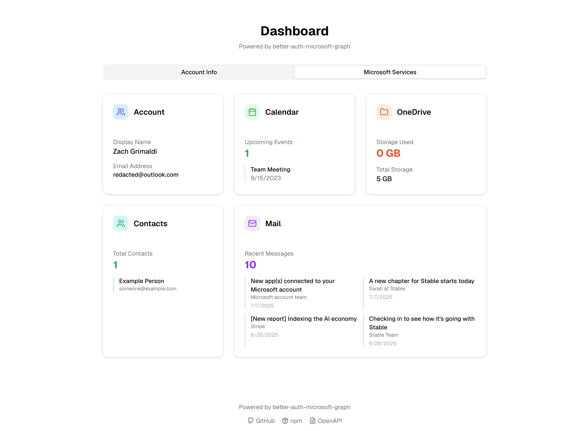

# `better-auth-microsoft-graph` Example: Next.js on Cloudflare Workers

This example demonstrates `better-auth-microsoft-graph` integration in a Next.js application deployed to Cloudflare Workers using OpenNext.



## Production Deployment

### 1. Environment Setup

Set your production environment variables using Wrangler:

```bash
# Set Microsoft OAuth credentials
npx wrangler secret put MICROSOFT_CLIENT_ID
# Enter your client ID when prompted

npx wrangler secret put MICROSOFT_CLIENT_SECRET
# Enter your client secret when prompted

npx wrangler secret put BETTER_AUTH_SECRET
# Enter a secure random string when prompted

npx wrangler secret put BETTER_AUTH_URL
# Enter your production URL, e.g., https://your-app.your-subdomain.workers.dev
```

### 2. Deploy to Production

```bash
# Install dependencies
pnpm install

# Generate auth schema
pnpm auth:generate

# Generate and apply database migrations
pnpm db:generate
pnpm db:migrate:prod

# Deploy to Cloudflare Workers
pnpm deploy
```

Your app is now live! 🚀

## Local Development

For local development, use environment files:

```bash
# Create local environment file
cp .env.example .env.local

# Add your development credentials
echo "MICROSOFT_CLIENT_ID=your_dev_client_id" >> .env.local
echo "MICROSOFT_CLIENT_SECRET=your_dev_client_secret" >> .env.local
echo "BETTER_AUTH_SECRET=your_dev_secret" >> .env.local
echo "BETTER_AUTH_URL=http://localhost:3000" >> .env.local

# Set up local database
pnpm db:migrate:dev

# Start development server
pnpm dev
```

## Key Files

- `src/auth/index.ts` - Auth configuration with Microsoft Graph scopes
- `src/auth/authClient.ts` - Client-side auth setup
- `src/components/MicrosoftGraphDemo.tsx` - Example Graph API usage
- `src/app/dashboard/page.tsx` - Protected dashboard page

## Microsoft Graph Integration

This example showcases:

- **Authentication**: Microsoft/Azure AD login
- **Profile Data**: User information display
- **Calendar Access**: Upcoming events
- **Email Access**: Recent messages
- **Contacts**: User contacts list
- **OneDrive**: Storage information

## Database Commands

```bash
# Generate auth schema from config
pnpm auth:generate

# Create migration files
pnpm db:generate

# Apply migrations
pnpm db:migrate:prod   # Production (recommended)
pnpm db:migrate:dev    # Local development

# Database studio
pnpm db:studio:prod    # Production
pnpm db:studio:dev     # Local
```

## Azure Setup

Configure your Azure App Registration with these permissions:

- `User.Read`, `Calendars.Read`, `Contacts.Read`, `Mail.Read`, `Files.Read`

Set redirect URI to: `https://your-app.your-subdomain.workers.dev/api/auth/callback/microsoft`

For detailed setup instructions, see the [main README](../../README.md).
